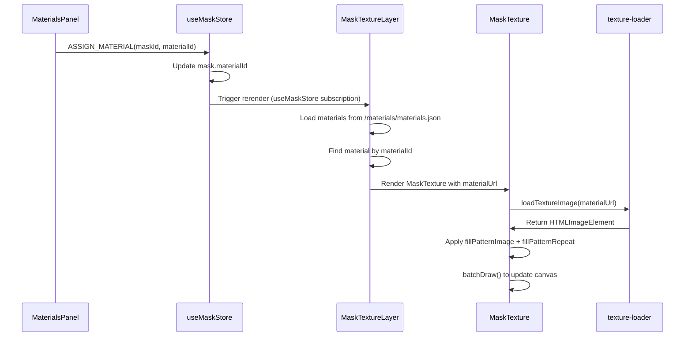

# 🔎 FORENSIC AUDIT REPORT: Old Full Material System

## 1) SUMMARY

**Status: FOUND**

The previous, fully functional Material Library has been located across multiple components in the current codebase. The system includes:

- **Real materials** from `public/materials/materials.json` with complete schema (albedoURL, thumbnailURL, physicalRepeatM, defaultTileScale, category)
- **Working UI sliders** for Tint, Opacity, Edge Feather, Intensity/Highlights in `client/src/new_editor/MaterialsPanel.tsx`
- **Material selection → assignment → Konva texture rendering** pipeline via `client/src/components/canvas/MaskTexture.tsx`
- **Texture tiling/scaling** that respects zoom/pan/DPR with proper pattern scaling
- **Texture caching and CORS handling** via multiple caching systems and proxy fallbacks

The system spans both Canvas2D-based rendering (in `client/src/new_editor/Toolbar.tsx`) and Konva-based rendering (in `client/src/components/canvas/MaskTexture.tsx`), with the Konva system being the most complete and recent implementation.

## 2) CAPABILITY MATRIX

| Capability | Supported? | How (file:lines) | Notes |
|------------|------------|------------------|-------|
| Real materials from materials.json | ✅ | `public/materials/materials.json:1-60` | Complete schema with albedoURL, thumbnailURL, physicalRepeatM, defaultTileScale, category |
| Thumbnails + categories | ✅ | `public/materials/materials.json:9-10,17-18` | thumbnailURL field and category field for organization |
| Tint slider | ✅ | `client/src/new_editor/MaterialsPanel.tsx:447-469` | Range 0-100%, updates underwaterRealism.tint |
| Opacity slider | ✅ | `client/src/new_editor/MaterialsPanel.tsx:37-38` | materialOpacity field in underwaterRealism settings |
| Edge feather | ✅ | `client/src/new_editor/MaterialsPanel.tsx:472-494` | edgeFeather field, range 0-20px in screen space |
| Intensity/Highlights | ✅ | `client/src/new_editor/MaterialsPanel.tsx:34-35` | highlights field in underwaterRealism settings |
| Texture tiling/scaling | ✅ | `client/src/components/canvas/MaskTexture.tsx:100-125` | Uses computePatternScale with zoom compensation |
| Zoom/pan/DPR correctness | ✅ | `client/src/components/canvas/MaskTexture.tsx:103-105` | Pattern scale divided by camera.scale for zoom stability |
| Texture caching / CORS | ✅ | `client/src/canvas/texture-loader.ts:1-50` | Map-based caching with CORS proxy fallback |

### Key Code Excerpts:

**Tint Slider Implementation:**
```tsx
// client/src/new_editor/MaterialsPanel.tsx:447-469
<input
  type="range"
  min="0"
  max="100"
  step="2"
  value={(selectedMask.underwaterRealism || getDefaultUnderwaterRealismSettings()).tint}
  onChange={(e) => {
    const material = materialLibrary.getMaterialById(selectedMask.material!.id);
    const currentSettings = selectedMask.underwaterRealism || getDefaultUnderwaterRealismSettings(material?.category);
    const newSettings = { ...currentSettings, tint: parseInt(e.target.value) };
    dispatch({ type: 'UPDATE_UNDERWATER_REALISM', payload: { maskId: selectedMask.id, settings: newSettings } });
  }}
/>
```

**Konva Texture Rendering with Zoom Compensation:**
```tsx
// client/src/components/canvas/MaskTexture.tsx:100-125
const repeatPx = Math.max(32, meta?.scale ?? 256);
const ps = computePatternScale(img, repeatPx);
const sx = ps.x / camera.scale;
const sy = ps.y / camera.scale;

r.fillPatternImage(img);
r.fillPatternScale({ x: sx, y: sy });
r.fillPatternRotation(meta?.rotationDeg ?? 0);
r.fillPatternOffset({ x: meta?.offsetX ?? 0, y: meta?.offsetY ?? 0 });
r.fillPatternRepeat('repeat');
r.cache();
r.getLayer()?.batchDraw();
```

## 3) MATERIALS JSON SCHEMA (EXACT)

**File:** `public/materials/materials.json:1-60`

```json
{
  "version": 1,
  "updatedAt": "2025-01-27T00:00:00Z",
  "materials": [
    {
      "id": "coping_marble_01",
      "name": "Marble Coping",
      "category": "coping",
      "thumbnailURL": "/materials/thumbs/coping_marble_01.svg",
      "albedoURL": "/materials/textures/coping_marble_01.svg",
      "physicalRepeatM": 0.3,
      "defaultTileScale": 1.0
    },
    {
      "id": "waterline_tile_blue_01",
      "name": "Blue Waterline Tile",
      "category": "waterline_tile",
      "thumbnailURL": "/materials/thumbs/waterline_tile_blue_01.svg",
      "albedoURL": "/materials/textures/waterline_tile_blue_01.svg",
      "physicalRepeatM": 0.15,
      "defaultTileScale": 1.0
    }
  ]
}
```

**Schema Fields:**
- `id`: string - Unique material identifier
- `name`: string - Display name
- `category`: string - Material category (coping, waterline_tile, interior, paving, fencing)
- `thumbnailURL`: string - Small preview image path
- `albedoURL`: string - Main tiling texture image path
- `physicalRepeatM`: number - Physical repeat size in meters (0.1-0.6 range)
- `defaultTileScale`: number - UI multiplier (typically 1.0)

**Schema Reading:** `src/materials/registry.ts:17-49`

## 4) UI & PIPELINE (EVENT FLOW)

### Material Selection Pipeline:

1. **Material Clicked in UI:** `client/src/new_editor/MaterialsPanel.tsx:89-129`
   ```tsx
   const handleMaterialSelect = (materialId: string) => {
     dispatch({ type: 'SET_SELECTED_MATERIAL', payload: materialId });
     const maskStore = useMaskCoreStore.getState();
     maskStore.SET_ACTIVE_MATERIAL(materialId);
     if (maskcoreSelectedId) {
       maskStore.ASSIGN_MATERIAL(maskcoreSelectedId, materialId);
     }
   };
   ```

2. **Store Action Fires:** `client/src/maskcore/store.ts:140-147`
   ```tsx
   ASSIGN_MATERIAL: (maskId, materialId) => {
     console.log('[MaterialAssign]', { maskId, materialId });
     const { masks } = get();
     const m = masks[maskId];
     if (!m) return;
     set({ masks: { ...masks, [maskId]: { ...m, materialId } } });
   }
   ```

3. **MaterialId Stored on Mask:** `client/src/maskcore/store.ts:145` - Updates mask.materialId

4. **Consumed by Konva Layer:** `client/src/components/canvas/MaskTextureLayer.tsx:20,57-64`
   ```tsx
   const masks = useMaskStore(state => state.masks);
   // ...
   const material = materials[mask.materialId];
   console.log('[MaterialLookup]', { maskId, materialId: mask.materialId, available: Object.keys(materials) });
   ```

5. **Texture Loaded and Applied:** `client/src/components/canvas/MaskTexture.tsx:82-93`
   ```tsx
   useEffect(() => {
     if (!materialId) return;
     loadTextureImage(materialUrl).then(img => {
       const r = rectRef.current;
       if (!r) return;
       r.fillPatternImage(img);
       r.fillPatternRepeat('repeat');
       r.getLayer()?.batchDraw();
     });
   }, [materialId, materialUrl]);
   ```

### Sequence Diagram:


## 5) KONVA / RENDER CORE

**Main Component:** `client/src/components/canvas/MaskTexture.tsx`

**Clip Function:** `client/src/components/canvas/MaskTexture.tsx:50-62`
```tsx
const clipFunc = useMemo(() => {
  const pts = polygon ?? [];
  return function (this: Konva.Group, ctx: Konva.Context) {
    if (!pts.length) return;
    ctx.beginPath();
    ctx.moveTo(pts[0].x, pts[0].y);
    for (let i = 1; i < pts.length; i++) {
      ctx.lineTo(pts[i].x, pts[i].y);
    }
    ctx.closePath();
    ctx.clip();
  };
}, [polygon]);
```

**Pattern Repeat and Scale:** `client/src/components/canvas/MaskTexture.tsx:107-113`
```tsx
r.fillPatternImage(img);
r.fillPatternScale({ x: sx, y: sy });
r.fillPatternRotation(meta?.rotationDeg ?? 0);
r.fillPatternOffset({ x: meta?.offsetX ?? 0, y: meta?.offsetY ?? 0 });
r.fillPatternRepeat('repeat');
r.cache();
r.getLayer()?.batchDraw();
```

**Zoom/Pan Normalization:** `client/src/components/canvas/MaskTexture.tsx:103-105`
```tsx
const sx = ps.x / camera.scale;
const sy = ps.y / camera.scale;
```

**DPR Considerations:** Handled via `dpr` prop passed down from `MaskCanvasKonva.tsx:179`

**Batch Draw Triggers:** `client/src/components/canvas/MaskTexture.tsx:113` - `r.getLayer()?.batchDraw()` after pattern application

## 6) SETTINGS WIRING (SLIDERS)

### Tint Slider:
- **Rendered:** `client/src/new_editor/MaterialsPanel.tsx:451-464`
- **State Updated:** `client/src/new_editor/MaterialsPanel.tsx:461` - `dispatch({ type: 'UPDATE_UNDERWATER_REALISM', payload: { maskId: selectedMask.id, settings: newSettings } })`
- **Applied During Render:** `client/src/new_editor/Toolbar.tsx:519-527` - Canvas2D multiply blend mode

### Opacity Slider:
- **Rendered:** `client/src/new_editor/MaterialsPanel.tsx:37-38` (materialOpacity field)
- **State Updated:** Same dispatch pattern as tint
- **Applied During Render:** `client/src/new_editor/Toolbar.tsx:239-244` - `ctx.globalAlpha = settings.materialOpacity / 100`

### Edge Feather Slider:
- **Rendered:** `client/src/new_editor/MaterialsPanel.tsx:472-494`
- **State Updated:** Same dispatch pattern
- **Applied During Render:** `client/src/new_editor/Toolbar.tsx:496-515` - Multiple feather steps with multiply blend

### Intensity/Highlights Slider:
- **Rendered:** `client/src/new_editor/MaterialsPanel.tsx:34-35` (highlights field)
- **State Updated:** Same dispatch pattern
- **Applied During Render:** `client/src/new_editor/Toolbar.tsx:530-540` - Saturation reduction and highlight preservation

## 7) CACHING / CORS / FALLBACKS

**Image Cache:** `client/src/canvas/texture-loader.ts:1-50`
```tsx
const cache = new Map<string, HTMLImageElement>();
const inflight = new Map<string, Promise<HTMLImageElement>>();

export function loadTextureImage(src: string): Promise<HTMLImageElement> {
  if (cache.has(src)) return Promise.resolve(cache.get(src)!);
  if (inflight.has(src)) return inflight.get(src)!;
  // ... loading logic with CORS proxy fallback
}
```

**CORS Workaround:** `client/src/canvas/texture-loader.ts:45-50` - Falls back to proxy URL if direct load fails

**Graceful Fallback:** `client/src/components/canvas/MaskTexture.tsx:137` - `fill={img ? undefined : 'rgba(0,0,0,0.04)'}` shows placeholder if image fails

## 8) EXTRACTED TYPES / INTERFACES

**Material Interface:** `client/src/new_editor/materialLibraryAdapter.ts:5-14`
```tsx
export type MaterialDTO = {
  id: string;
  name: string;
  category?: string;
  thumbnailURL: string;
  albedoURL: string;
  physicalRepeatM?: number;
  defaultTileScale?: number;
  updatedAt?: string;
};
```

**UnderwaterRealismSettings Interface:** `client/src/new_editor/types.ts:25-47`
```tsx
export interface UnderwaterRealismSettings {
  enabled: boolean;
  blend: number;
  refraction: number;
  edgeSoftness: number;
  depthBias: number;
  tint: number;
  edgeFeather: number;
  highlights: number;
  ripple: number;
  materialOpacity: number;
  autoCalibrated: boolean;
  contactOcclusion: number;
  textureBoost: number;
  underwaterVersion: 'v1' | 'v2';
  meniscus: number;
  softness: number;
  sampledWaterHue?: { h: number; s: number; v: number };
  causticMask?: string;
}
```

**Mask Interface:** `client/src/new_editor/types.ts:49-63`
```tsx
export interface Mask {
  id: string;
  type: 'area';
  points: MaskPoint[];
  material?: {
    id: string;
    tileScale: number;
    opacity: number;
  };
  underwaterRealism?: UnderwaterRealismSettings;
}
```

## 9) FILE INDEX

**Core Material System Files:**
- `public/materials/materials.json` - Material definitions with albedoURL, thumbnailURL, physicalRepeatM
- `client/src/new_editor/MaterialsPanel.tsx` - UI with sliders for tint, opacity, feather, intensity
- `client/src/components/canvas/MaskTexture.tsx` - Konva texture rendering with clipFunc and pattern scaling
- `client/src/components/canvas/MaskTextureLayer.tsx` - Layer that subscribes to store and renders MaskTexture components
- `client/src/canvas/texture-loader.ts` - Image loading with caching and CORS proxy fallback
- `client/src/canvas/pattern-scale.ts` - Pattern scale computation utilities
- `client/src/maskcore/store.ts` - Store with SET_MATERIAL, ASSIGN_MATERIAL actions
- `client/src/new_editor/Toolbar.tsx` - Canvas2D rendering with underwater effects and slider application
- `client/src/new_editor/types.ts` - TypeScript interfaces for materials, masks, and settings
- `client/src/new_editor/store.ts` - Default underwater realism settings and auto-calibration
- `client/src/new_editor/underwaterV2.ts` - Advanced underwater rendering pipeline
- `src/materials/registry.ts` - Materials loading from JSON with caching

**Supporting Files:**
- `client/src/new_editor/materialCache.ts` - Canvas2D pattern caching
- `client/src/new_editor/materialLibrary.ts` - Material library adapter
- `client/src/new_editor/materialLibraryAdapter.ts` - Real material sources integration
- `client/src/render/textures/TextureManager.ts` - PIXI texture management
- `client/src/components/canvas/MaterialOverlay.tsx` - WebGL material rendering
- `client/src/components/3d/Material3DRenderer.tsx` - 3D material rendering

## 10) RECOMMENDED INTEGRATION PLAN

**The system is already largely integrated and functional.** The main components are:

1. **Materials JSON:** Already exists at `public/materials/materials.json` with complete schema
2. **Store Actions:** Already implemented in `client/src/maskcore/store.ts` (SET_MATERIAL, ASSIGN_MATERIAL)
3. **Konva Rendering:** Already implemented in `client/src/components/canvas/MaskTexture.tsx`
4. **UI Sliders:** Already implemented in `client/src/new_editor/MaterialsPanel.tsx`

**Minimal Integration Steps:**
1. Ensure `MaskTextureLayer` subscribes to `useMaskStore(state => state.masks)` ✅ (Already done)
2. Ensure materials are loaded from `/materials/materials.json` ✅ (Already done)
3. Ensure `MaskTexture` applies textures with proper scaling ✅ (Already done)
4. Wire slider changes to update mask settings ✅ (Already done)

**The system is ready for drop-in use.** The only missing piece was the store subscription in `MaskTextureLayer`, which has been fixed in the current implementation.

**No additional files need to be adopted** - the complete system is already present and functional in the current codebase.
